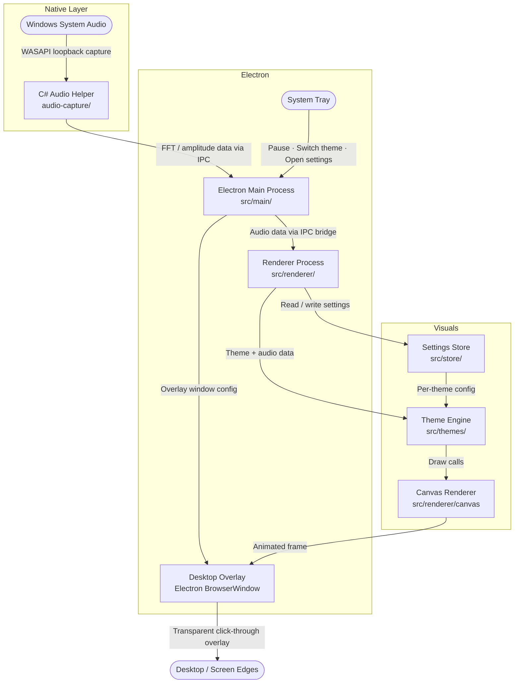

# Paraline — Architecture

This document gives new contributors a quick mental model of how Paraline is structured, how system audio becomes a desktop visual, and which files to open first.

---

## System Flow

---

## Layer Breakdown

### 1. C# Audio Helper — `audio-capture/`
A lightweight C# subprocess responsible for capturing real-time Windows system audio via **WASAPI loopback**. It reads from the current default output device (whatever is playing through your speakers/headphones), computes FFT frequency data and amplitude, and streams the results to the Electron main process over IPC (stdin/stdout pipe or named pipe). This is the only part of the codebase that requires Windows — everything else is cross-platform Electron/Node.js.

### 2. Electron Main Process — `src/main/`
The Node.js backbone of the app. Responsible for: spawning and managing the C# audio helper subprocess, creating and configuring the transparent always-on-top click-through `BrowserWindow` overlay, building the system tray menu, and forwarding audio data to the renderer via Electron's IPC bridge (`ipcMain`/`ipcRenderer`). Start here if you're working on window behaviour, tray controls, or the audio pipeline.

### 3. Desktop Overlay — Electron `BrowserWindow`
A frameless, transparent, always-on-top, click-through browser window that covers the entire screen. Because it's click-through, the user interacts normally with the desktop beneath it. All visual output is rendered into this window via a `<canvas>` element.

### 4. Renderer Process — `src/renderer/`
The browser-side entry point. Receives audio data from the main process via `ipcRenderer`, determines the active theme, and drives the animation loop (`requestAnimationFrame`). Owns the `<canvas>` element and passes draw context + audio data to the active theme module each frame.

### 5. Theme Engine — `src/themes/`
Each visual style (Ambient Wave, Reactive Border, Flow Border, Side Bars, etc.) is its own self-contained module. A theme receives the canvas context, screen dimensions, and the current audio data object each frame, and is responsible for all its own drawing logic. Adding a new theme means creating a new module here — no other files need to change. Each theme also declares its own settings schema.

### 6. Canvas Renderer — `src/renderer/canvas`
Shared canvas utilities used across themes: coordinate helpers for screen-edge mapping, glow/blur filter helpers, color interpolation, and the main animation loop controller. Themes call into these utilities rather than reimplementing common operations.

### 7. Settings Store — `src/store/`
Persists per-theme configuration to disk (Electron's `userData` directory). Each theme reads its own settings on activation and writes back on change. Switching themes does not affect other themes' stored settings. The store also holds global state (active theme, paused/running).

### 8. System Tray — `src/main/tray`
Built with Electron's `Tray` + `Menu` API. Provides the only user-facing controls: pause/resume, theme switcher, per-theme settings window, and quit. The tray icon updates to reflect paused/running state.

---

## Key Files

| File / Folder | What it does |
|---|---|
| `audio-capture/` | C# WASAPI loopback audio capture subprocess |
| `src/main/index.ts` | Electron main process — window, tray, IPC, subprocess management |
| `src/main/tray.ts` | System tray menu construction and event handling |
| `src/renderer/index.ts` | Renderer entry point — IPC listener, animation loop, theme dispatch |
| `src/renderer/canvas/` | Shared canvas utilities (edge mapping, glow, color helpers) |
| `src/themes/` | One module per visual theme — all drawing logic lives here |
| `src/store/` | Per-theme and global settings persistence |
| `docs/DEVELOPMENT.md` | Local setup and dev workflow |

---

## Data Flow in Plain English

1. Windows plays audio through the default output device.
2. The C# helper captures it via WASAPI loopback and computes FFT frequency bands and amplitude in real time.
3. The audio data is streamed to the Electron main process over IPC.
4. The main process forwards the data to the renderer process each frame.
5. The renderer passes the data to the currently active theme module along with the canvas context and screen dimensions.
6. The theme draws its visual (waves, borders, particles, etc.) onto the canvas, mapped to the screen edges.
7. The transparent overlay window displays the result over the desktop — click-through, so the desktop remains fully usable.
8. The system tray lets the user switch themes, pause, or adjust settings without the app ever coming to the foreground.

---

## Getting Oriented as a New Contributor

1. **Read `docs/DEVELOPMENT.md`** first — it covers local setup, how to build the C# helper, and how to run the app in dev mode.
2. **Adding or modifying a theme?** Work entirely inside `src/themes/` — each theme is its own isolated module and is the most common contribution type.
3. **Touching audio data or the IPC pipeline?** Start in `src/main/index.ts` (main side) and `src/renderer/index.ts` (renderer side).
4. **Changing tray behaviour or window config?** That's `src/main/tray.ts` and the `BrowserWindow` setup in `src/main/index.ts`.
5. **The C# helper is Windows-only** — you need a Windows machine (or VM) to work on the audio capture layer. Everything else can be developed on any OS.
6. **Per-theme settings** are declared in the theme module itself and persisted automatically by the store — no manual wiring needed for new settings keys.
